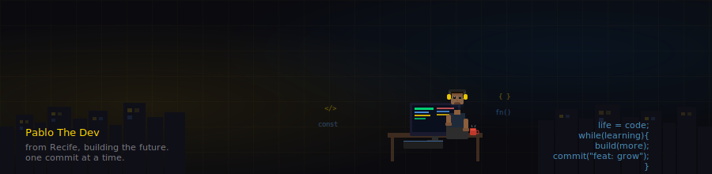

# Pablo Santos here 🔥 !

**Salve ✌️ — Eu sou o Pablo Santos**

---

## ⚡ About Me

- 🎓 Estudante de **ADS** — Uninassau, Recife/PE · 3º semestre
- 💻 Foco em front-end: **React, Next.js, TypeScript e Tailwind CSS**
- 🏛️ Construindo a **Barbearia Nobre** — landing page Next.js 15 + Tailwind v4 + estética vintage
- 📦 Explorei **NestJS** com a `pacientes-api` — API REST com arquitetura em 3 camadas
- ⚡ Me pergunta sobre: **React, Next.js, TypeScript, Tailwind CSS v4**
- 🎯 Buscando primeira oportunidade como **dev front-end / estagiário**
- 🧩 Gosto de aprender de verdade quando entendo o **porquê** das coisas

 

---

☀️ **Follow Me on:**

---

## ⚙️ Tech Stack

---

## ⚡ GitHub Stats

---

## 🚀 Projetos em Destaque

| Projeto | Descrição | Stack |
|---|---|---|
| [🏛️ Barbearia Nobre](https://github.com/PabloJDev/barbearia-nobre) | Landing page vintage para barbearia | Next.js 15 · TypeScript · Tailwind v4 |
| [📈 Simulador de Bolsa](https://github.com/PabloJDev) | Simulador de mercado financeiro — front-end solo | React · TypeScript |
| [🏥 Pacientes API](https://github.com/PabloJDev/pacientes-api) | REST API para cadastro de pacientes | NestJS · TypeScript |

---

